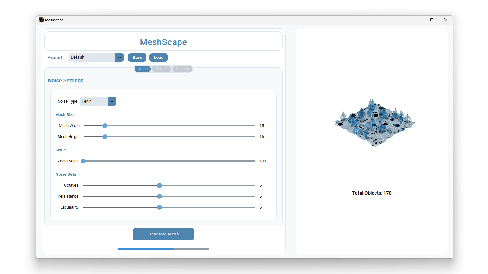
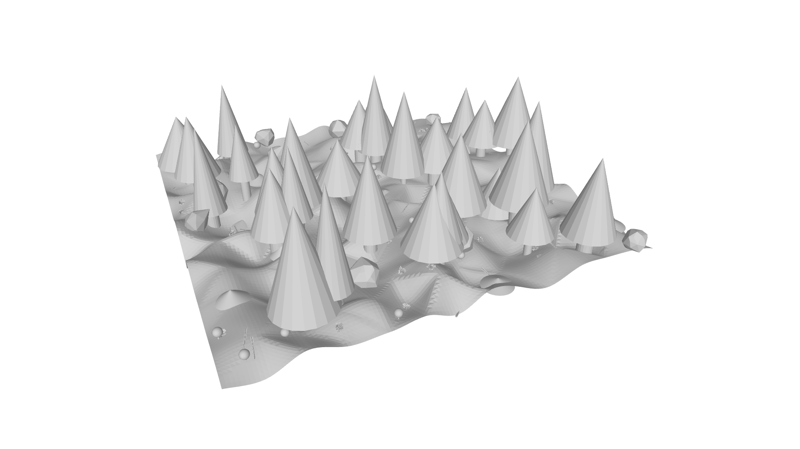

# MeshScape

**MeshScape** is a modern, parametric 3D terrain and object simulation tool for robotics, research, and 3D modeling. It combines advanced procedural generation, real-time visualization, and a user-friendly interface to empower engineers, researchers, and creators to rapidly prototype and test in realistic virtual environments.

---

## Why MeshScape?

- **Professional-Grade Terrain Generation:**  
  Generate highly customizable terrains using Perlin, Simplex, Value, and Cellular noise. Fine-tune resolution, elevation, scale, octaves, persistence, and lacunarity for precise control.

- **Dynamic Object Placement:**  
  Procedurally add trees, rocks, sticks, bushes, anthills, and more—each with density, scale, and randomness controls.

- **Real-Time Visualization:**  
  Instantly preview and interact with your 3D scene using a responsive, multi-threaded UI and PyVista-powered 3D rendering.

- **Modern, Intuitive UI:**  
  Built with CustomTkinter for a clean, professional look. Features tooltips, presets, and real-time feedback.

- **Seamless Export:**  
  Export your terrains and scenes as STL for 3D printing or simulation, and PNG for noise maps.

- **Ready for Robotics & Research:**  
  Designed for integration with simulation pipelines and rapid prototyping.

---

## Key Features

- **Noise-based Terrain Generation:**  
  - Multiple noise algorithms (Perlin, Simplex, Value, Cellular)
  - Full parametric control (resolution, elevation, scale, octaves, etc.)

- **Procedural Object Placement:**  
  - Trees, rocks, sticks, bushes, anthills, mushrooms, and more
  - Density, scale, and randomness controls

- **Real-Time 3D Visualization:**  
  - PyVista and Matplotlib integration
  - Interactive mesh preview and object count tracking

- **Modern GUI:**  
  - CustomTkinter-based, with splash screen and icon
  - Preset save/load system
  - Tooltips and parameter feedback

- **Robust Architecture:**  
  - MVC-inspired: `Model/`, `View/`, `Controller/`
  - Modular code for easy extension

- **Export & Data Management:**  
  - All outputs saved to a dedicated `data/` folder
  - Exports: `combined_terrain_with_objects.stl`, `exported_mesh.stl`, `noise.png`

---

## Screenshots


*MeshScape's modern UI with real-time 3D terrain preview and noise controls.*


*Example of a procedurally generated terrain with objects (trees, rocks, etc.) in 3D view.*

---

## Quick Start

### 1. Clone the repository
```bash
git clone https://github.com/nixonboros/MeshScape-3D-Mesh-Simulation.git
cd MeshScape-3D-Mesh-Simulation
```

### 2. Install dependencies
```bash
pip install -r requirements.txt
```

### 3. Run the application (Development)
```bash
python View/main.py
```

### 4. Build a standalone EXE (Windows)
```bash
pyinstaller MeshScape.spec
# Then run: dist/MeshScape.exe
```

---

## Directory Structure

```
meshscape-3dmeshsimulation
├── assets
│   └── icon.ico                  # Application icon
├── build                         # PyInstaller build artifacts
├── Controller
│   ├── __init__.py
│   ├── Gen
│   │   ├── MeshGenOnNoise.py     # Mesh generation on noise
│   │   ├── noise_mesh_gen.py     # Noise-based mesh generation logic
│   │   ├── noisethingy.py        # Noise generation utilities
│   │   └── __pycache__/
│   ├── ObGen
│   │   ├── AntHillGen.py         # Anthill object generator
│   │   ├── BushGen.py            # Bush object generator
│   │   ├── OakGen.py             # Oak tree object generator
│   │   ├── PlaceObjects.py       # Object placement logic
│   │   ├── RockGen.py            # Rock object generator
│   │   ├── StickGen.py           # Stick object generator
│   │   ├── TreeGen.py            # Tree object generator
│   │   └── __pycache__/
│   └── __pycache__/
├── data                          # All generated outputs (STL, PNG, etc.)
│   ├── combined_terrain_with_objects.stl
│   ├── exported_mesh.stl
│   └── noise.png
├── dist
│   ├── MeshScape.exe             # Standalone Windows executable
│   └── data/                     # Output data when running EXE
├── Model
│   ├── __init__.py
│   ├── database.py               # Database logic (MongoDB, Motor)
│   ├── documentSchema.py         # Data schema definitions
│   └── __pycache__/
├── requirements.txt              # Python dependencies
├── MeshScape.spec                # PyInstaller build specification
├── View
│   ├── main.py                   # Main GUI and application entry point
│   └── __init__.py
├── README.md                     # Project documentation
└── .venv/                        # Python virtual environment (not tracked)
```

---

## Requirements

- Python 3.8+
- See `requirements.txt` for all dependencies: 
  - customtkinter, matplotlib, numpy, scipy, Pillow, PyQt5, pyvista, pyvistaqt, numpy-stl, trimesh, noise, rtree, mongodb, motor

---

## Output Files

All generated files are saved in the `data/` directory:
- `combined_terrain_with_objects.stl` — Final mesh with all objects
- `exported_mesh.stl` — Base terrain mesh
- `noise.png` — Noise map used for terrain generation

---

## For Hiring Managers

MeshScape demonstrates:
- **Modern Python GUI development** (CustomTkinter, PyQt5)
- **Advanced procedural generation** and 3D mesh manipulation
- **Clean, modular architecture** (MVC-inspired, extensible)
- **Attention to UX** (splash screen, icons, tooltips, presets)
- **Production-ready packaging** (PyInstaller EXE, resource management)
- **Real-world application** for simulation, robotics, and 3D modeling

---
